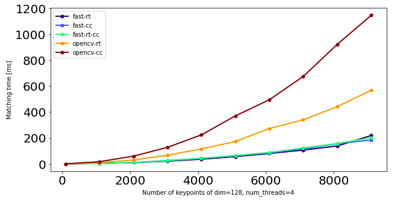

# fast-bfmatcher

Faster implementation of the OpenCV BFMatcher(cv2.NORM_L2) matcher for image keypoint
matching



## Usage

* CC stands for Cross-Check
* RT stands for ratio test i.e. Lowe's ratio test proposed in the original SIFT paper

```python
import os
import cv2

# set number of threads for BLIS, must be set 
# before import, cannot be change later
os.environ["BLIS_NUM_THREADS"] = "4"


# running benchmarks
from fast_bfmatcher import FastL2RTBFMatcher, FastL2CCBFMatcher, FastL2RTCCBFMatcher

sift = cv2.SIFT_create()

_, des1 = sift.detectAndCompute(image1, None)
_, des2 = sift.detectAndCompute(image2, None)

fast_matcher_rt = FastL2RTBFMatcher(ratio=0.7)
fast_matcher_cc = FastL2CCBFMatcher() # cross check matcher
fast_matcher_rt_cc = FastL2RTCCBFMatcher(ratio=0.7) # cross check and ratio test

fs_match = fast_matcher_rt.match(des1, des2)
cv_match = fast_matcher_cc.match(des1, des2)

# match contains indices and distances
fs_match.indices, fs_match.distances

```

# Installation
```bash
 # (recommended) to build BLIS on the host machine 
 pip install git+https://github.com/kmkolasinski/fast-bfmatcher
 # to install pip prebuild package
 pip install fast-bfmatcher
```


# Information

* Speed up is achieved thanks to fast [blis](https://github.com/flame/blis) library
* Optimized with SIMD instructions custom C implementations


# Quick command to check speedup

```python
import os
import cv2

# fix number of threads for BLIS, must be set 
# before using this library, cannot be change
# later
os.environ["BLIS_NUM_THREADS"] = "4"

# fix number of threads for numpy
os.environ["OMP_NUM_THREADS"] = "4"

# fix number of threads for OpenCV
cv2.setNumThreads(4) 

import pandas as pd
from fast_bfmatcher.benchmark import benchmark_cc_rt_size_scan
from fast_bfmatcher.benchmark import benchmark_cc_matchers

benchmark_cc_matchers()

# to generate the plot above run this benchmark
metrics = benchmark_cc_rt_size_scan()
df = pd.DataFrame(metrics)
ax = df.set_index("size").plot(lw=2, colormap='jet', marker='.', markersize=10, figsize=(10, 5), fontsize=20)
ax.set_xlabel("Dim")
ax.set_ylabel("Time [ms]")

```


# Building library locally

```bash
python setup.py build_ext --inplace
```

# Testing 

```bash
export BLIS_NUM_THREADS=8;
export OMP_NUM_THREADS=8
pytest -s
```
